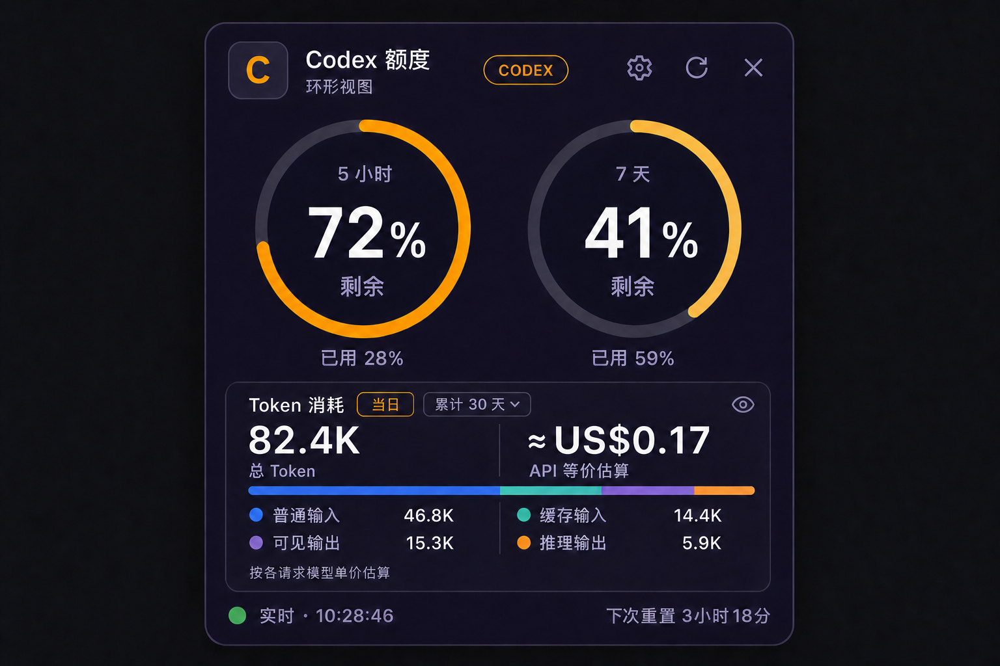

# Codex 额度悬浮窗

一个轻量的 Windows 置顶悬浮窗，用环形或卡片视图显示 Codex 当前额度窗口的**剩余百分比**、重置倒计时，以及本地会话中的 Token 消耗、Standard API 等价金额和独立的速度档位金额估算。

本仓库只包含源码、测试和设计预览，不包含用户会话、登录凭据或本机生成的数据。本项目是社区工具，不是 OpenAI 官方产品。

版本变化见 [CHANGELOG.md](./CHANGELOG.md)。



_预览图中的额度、Token、金额与时间均为虚构示例数据。_

## 直接使用

双击 [`启动悬浮窗.cmd`](./启动悬浮窗.cmd)。首次从源码启动需要 .NET 8 SDK 自动构建，之后会直接打开本地生成的单文件程序。若仓库发布了预编译版本，请从 GitHub Releases 下载，不要从源码分支获取未知二进制文件。

窗口支持：

- 在“环形”和“卡片”两种额度视图间切换；环形视图同时显示短周期与长周期剩余额度；
- 实时显示短周期与长周期额度（窗口名根据 Codex 返回的分钟数生成，不写死）；
- 显示重置倒计时、套餐类型、可用重置卡，以及存在时的 Credits/个人额度；
- Token 面板支持“当日”与“累积”口径，累积周期可选近 7/30/90 天、全部或自定义日期；
- Token 分为普通输入、缓存读取、可见输出、推理输出四个互斥类别，并显示总量、分布条、Standard API 等价金额与速度档位估算；
- Token 面板可以单独隐藏，之后可从右键菜单或外观设置恢复；
- 无边框、始终置顶、拖动定位；四条边和四个角都可以直接拉伸；默认约为完整设计的 50%（`230 × 244`），最小可缩至 `160 × 120`；
- 主界面通过等比布局缩放；无论横向、纵向拉伸还是压缩，圆环、文字和图标都不会被单轴拉扁；
- 点击齿轮可调整视图风格、Token 面板、累积周期、宽度、高度、整体透明度、强调色和背景色，支持预设色与 `#RRGGBB` 自定义颜色；
- 透明度限制在 50%–100%，浅色背景会自动切换为深色文字，保证基本可读性；
- 右键可刷新、打开外观设置、切换置顶或打开官方 Usage 面板；
- 记住窗口位置、尺寸、透明度、颜色与置顶设置；
- 单实例运行，关闭窗口时会回收后台子进程。

## 数据来源与隐私

- 额度信息来自本机 Codex，并显示服务端提供的剩余百分比与重置时间；接口暂不可用时会明确标为“缓存”。
- Token 统计来自本地 Codex 会话日志，只处理计数、模型、档位和时间信息。
- 程序不读取登录凭据，不展示提示词或回复正文，也不上传使用统计。

完整的数据边界见 [PRIVACY.md](./PRIVACY.md)。

## Token 统计与金额估算

Token 面板按本地日期汇总，并将使用量分为四个互不重叠的类别：

- 普通输入：输入 Token 扣除缓存读取后的部分，其中缓存写入仍属于普通输入显示；
- 缓存读取：`cached_input_tokens`；
- 可见输出：输出 Token 扣除推理 Token；
- 推理输出：`reasoning_output_tokens`。

界面同时提供 Standard API 等价金额和线程速度档位估算。历史日志信息不完整时，档位金额会采用参考价格补全，并明确显示推定 Token 比例。

金额仅用于本地估算，不是 ChatGPT/Codex 订阅账单或实际扣款。计算口径、兜底规则及定价来源见 [金额估算说明](./docs/PRICE_ESTIMATION.md)。

## 构建、测试与发布

要求 Windows 10/11 与 .NET 8 Desktop Runtime；从源码构建需要 .NET 8 SDK。

```powershell
dotnet build .\src\CodexUsageWidget\CodexUsageWidget.csproj -c Release
dotnet run --project .\tests\CodexUsageWidget.SmokeTests\CodexUsageWidget.SmokeTests.csproj -c Release -- --integration
.\发布.ps1
```

`发布.ps1` 默认生成依赖本机 .NET 8 Desktop Runtime 的小体积单文件。若要发给未安装 .NET 8 的 Windows 电脑：

```powershell
.\发布.ps1 -SelfContained
```

发布结果位于 `artifacts\publish\CodexUsageWidget.exe`。窗口位置、尺寸、样式、Token 口径和外观设置保存在 `%LOCALAPPDATA%\CodexQuotaWidget\settings.json`。

## 许可证

本项目采用 [MIT License](./LICENSE)。
